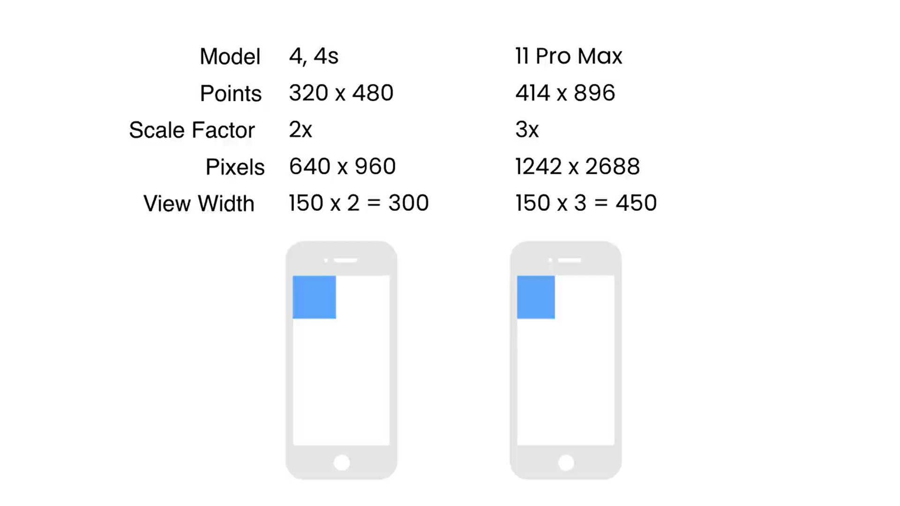
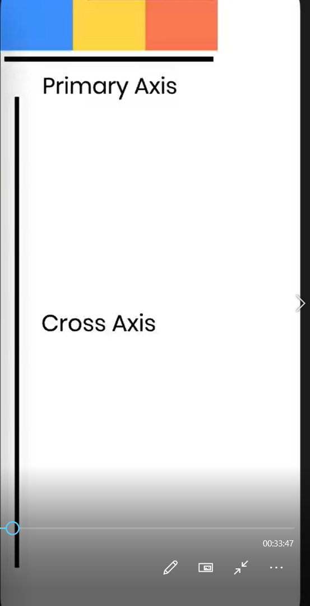
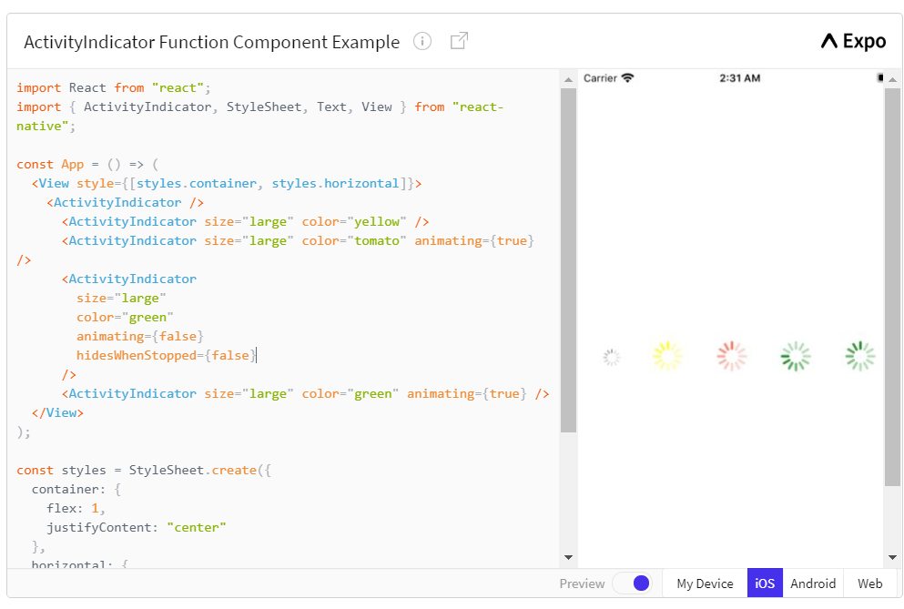

# React Native

- Can be installed in to ways
  - expo => npm install -g expo-cli => expo init proj_name
  - react-native-cli => npm install -g react-native-cli => react-native init proj_name

# Expo

## Extensions installed

- Material Icon Theme - Phillipp kief
- Prettier code formatter - esbenp.prettier-vscode
- React Native tools - Microsoft
- React-Native/React/Redux-snippets for es6/es7

## Settings changed

-> Settings -> formatonsave -> check ->close

```
To run your project, navigate to the directory and run one of the following npm commands.

- cd DoneWithIt
- npm start # you can open iOS, Android, or web from here, or run them directly with the commands below.
- npm run android
- npm run ios # requires an iOS device or macOS for access to an iOS simulator
- npm run web
```

# Notes

## Assets folder

<p>
    This is where all the assets related to the project are put
</p>

## App.js

<p>
    Basic react component
    <View> ->  is like a <div>
    <Text> -> is used to display text on the screen
</p>

## React Notes

- if we remove alignItems and justifyContent the contents of the view starts from the notification area so to prevent that from happening instead of view "SafeAreaView" is used. only works for phones with notch(compatible only with ios)

- If No of lines inside text is big then you could truncate it by using "numberOfLines"

## Example1

### Text

- Text supports styling, nesting and touchHandling

### Image

- For local images we need not to set dimensions because require function reads the meta data of image
- whereas images from internet has to be given width and height

* Image component does not have onPress method but onPress can be implemented by wrapping Image component around Touchable Components

### Touchables

- TouchableWithoutFeedback
- TouchableOpacity
- TouchableHighlight
- TouchableNativeFeedback

## Example2

- Button
- Alert
- Customised alerts
- Prompt(not compatible with android)alert with textbox init

## Example3

- Different phones have different height status bars ios has SafeAreaView api to place contents below notch or status bar but for android devices safe area view can be done be knowing the satusbar heigh.
- Status bar height can be known using StatusBar api
- The target platform can be known using Platform API
- StatusBar from 'reactNative' has a property called currentHeight which can be used to place view just below the statusBar

### Example 4

- Dimensions of the screen can be known using Dimensions API
- This API Doesnt respond to orientation changes
- Screen Dimensions and Window dimensions are same in IOS whereas in android window dimensions are sligthly lower than screen dimensions
  

### Example 5

- Detecting orientation changes.
- Go to app.json and set orientation to default to support both landscape and portrait orientation
- useDimensions updates the state as the orientation changes(this is one of the drawback of dimensions API)
-

#### Hooks

- Hooks are special function that bring special capabalities to function components
- useDimensions hook is used to know the dimensions in real time
- useDeviceOrientation hook is used to know the orientation in real time.

```
npm install @react-native-community/hooks
```

### Example6

- mess with flex value to see changes
- consider 3 views each having flex value as 1(total = 3 so each gets 1/3 oh height)
- consider 3 views having 1,2,1 flex vals respectively(total = 4 so 1st one gets 1/4 of screen, 2nd gets 2/4 of screen and 3rd gets 1/4 of screen)
- flexDirection: "column-reverse" makes the views arrange in reverse order starting from the bottom of the screen
- :row arranges in rows
- :row-reverse arranges in rows in reverse order starting from the right most of the screen
  
- if flex direction is set to row the main(primary) axis is horizontal axis

### Example7

- justifyContent is used to place the view in right(flex-end), left(flex-start) or center of the screen(on main axis)
- distributive propertie:- space-around(gives the space around all the views), space-between(gives the space between the views), space-evenly(evenly spaces between the views)
- alignItem is used align views on secondary axis(cross axis)
- alignSelf is applied to individual items
- To align all the items in the center of screen alignContent is used
- alignContent has effect only if there is a wrapping
- flexBasis sets the val of main axis property ie width in terms of horizontal axis or height in terms of vertical axis
- flexGrow is as same as flex
- flexShrink :- if overflow occurs the component with this property shrinks to fit the overflown items
- flexShrink and flexGrow can be achieved by setting flex values to negative for flexShrink and positive for flexGrow

### Example 8

- top and bottom properties are used to set the views relative to the current position
- using these properties elements can be positioned without affecting the layout
- positioning ie relative, absolute works as same as in css.
- relative positioning the rest of the elements remains in the same posiiton and the this element changes its positioning relative to the current position
- absolute postions the element relative to the parent element. The rest of the elements position gets affected
- All the elements are by default set to relative positioning

## CSS Notes

<p>
    flex : 1 ->  makes the view to extend both horizontally and vertically </br>
    <b>alignItems</b> is for horizontal alignment of content <br />  
    <b>justifyContent</b> is for vertical alignment of content
</p>
<p>
    when flex is set to 1 it takes the available free space and if to .5 it takes half the screen
</p>

## Q and A

- Why does items get aligned vertically?
  Because phones are usually held in portrait mode

# React-Navigation

https://reactnavigation.org/docs/getting-started

```
npm install @react-navigation/native
also install
react-native-gesture-handler, react-native-reanimated, react-native-screens and react-native-safe-area-context, @react-native-community/masked-view and
@react-navigation/stack
```

## for expo managed projects

```
expo install react-native-gesture-handler react-native-reanimated react-native-screens react-native-safe-area-context @react-native-community/masked-view
```

## Core Components

### ActivityIndicatorDemo

- Props
  - size (numbers can be given on android)
  - color
  - animating
  - hidesWhenStopped(ios) tho not animating the progress bar remains on the screen
    

### ButtonDemo

- Props
  - title(mandatory)
  - color
  - disables
  - touchSoundDisabled(Android)

skipped :- FlatList Dynamic onPress implementation(imp)
